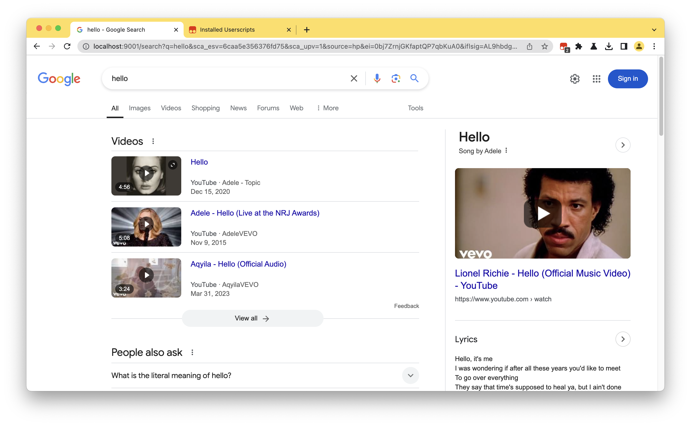

# prixi

prixi offers a way to search on google while focusing on privacy. it's a proxy that cuts out the tracking and junk from search results.

- handles google search requests privately
- gets rid of ads and tracking from search results
- tweakable with environment variables
- comes with a tampermonkey script for more client-side tweaks

## how it operates

it sits between you and google, sending out your search, cleaning up the response, and then passing it back to you sans trackers and clutter.

<center>
  
</center>

## set up & how to use

### docker

to run prixi with docker, these commands should do the trick:

```bash
docker build -t prixi .
docker run -p 9001:9001 -e TARGET_URL=https://www.google.com -e LOCAL_HOSTNAME=localhost prixi
```

tune it with environment variables:

- `TARGET_URL`: url you're proxying; defaults to https://www.google.com
- `LOCAL_PROTOCOL`: server protocol; defaults to http
- `LOCAL_HOSTNAME`: server hostname; defaults to localhost
- `LOCAL_PORT`: server port; defaults to 9001
- `PROXY_PORT`: proxy server port; defaults to 9001

### tampermonkey userscript

there's a tampermonkey script that gives you even more control on the browser side.

#### tampermonkey 101

it's a browser extension that lets you run custom js on websites.

#### what the prixi script does

1. strips extra fluff from your search results page
2. swaps the google logo for something custom
3. adjusts links to keep your browsing in the prixi zone
4. enhances page style for better legibility

#### to set up the script

1. install tampermonkey in your browser
2. create a new script in the extension
3. grab the script from tampermonkey/userscript.js and copy it over
4. save and let it run automatically when you use prixi (like visiting http://localhost:9001)

## pitch in

got tweaks or fixes for prixi? throw in a pull request or flag an issue.

## the legal bit

it's under mit license.

## heads up

just keep in mind prixi is a teaching tool. get too crafty with proxies and altering search results and you might step on google's terms. be wise.
